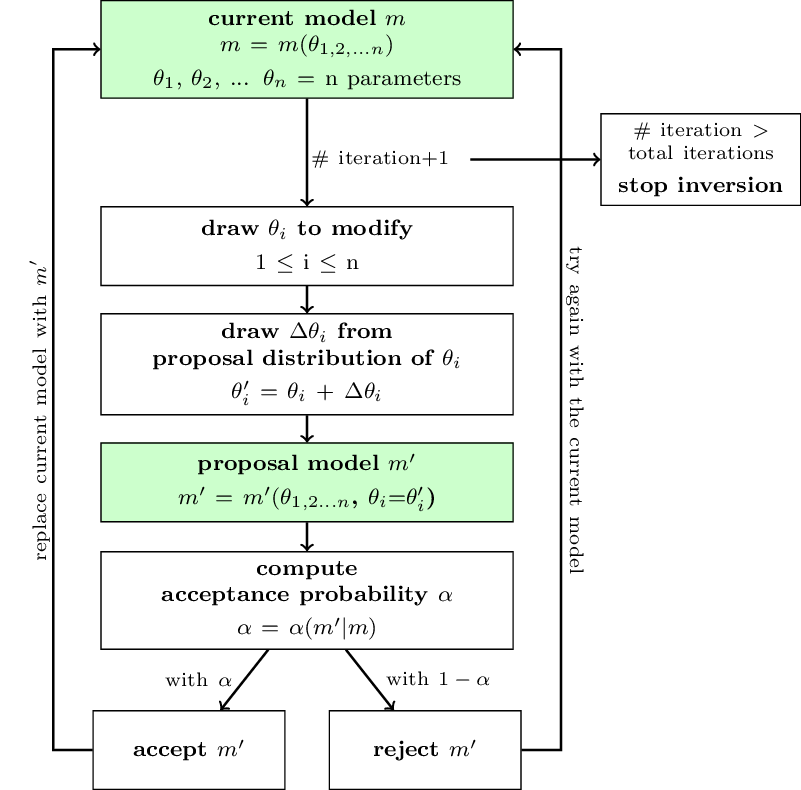

<!--more-->

BayHunter : 基于McMC(马尔可夫链蒙特卡洛)跨维贝叶斯方法联合反演面波频散和接收函数

## 1）Overview 概览

### 摘要

**BayHunter** 是一个基于Python语言对面波频散和/或接收函数进行马尔可夫链蒙特卡洛(McMC)跨维贝叶斯反演的开源工具。该算法遵循数据驱动的策略并解决速度-深度结构、模型层数、$V_P/V_S$比及噪声参数(例如数据噪声互相关及振幅)。程序包中同样提供了正演模拟代码，但很容易用自己的代码替换。程序包还可以添加其他(完全不同的)数据集(如ZH比?)。

**BayWatch** 模块可用于在反演过程中实时观察反演运行过程(如下面动画所展示)。这使得我们很容易看到每个链(chain)是如何搜索参数空间、数据是如何拟合、模型是如何变化、以及反演的方向是什么。

<!-- mp4格式 -->
<video id="video" controls="" preload="none" poster="封面">
      <source id="mp4" src="baywatch.mp4" type="video/mp4">
</video>

Available on GitHub: [https://github.com/jenndrei/BayHunter](https://github.com/jenndrei/BayHunter)

### 引用

Dreiling, J., Tilmann, F. BayHunter – McMC transdimensional Bayesian inversion of receiver functions and surface wave dispersion. GFZ Data Services, 2019. [https://doi.org/10.5880/GFZ.2.4.2019.001](https://doi.org/10.5880/GFZ.2.4.2019.001).

### 应用实例

- Dreiling et al., 2020: Crustal structure of Sri Lanka derived from joint inversion of surface wave dispersion and receiver functions using a Bayesian approach. Journal of Geophysical Research: Solid Earth. [https://doi.org/10.1029/2019JB018688](https://doi.org/10.1029/2019JB018688).

- Green et al., 2020: Magmatic and sedimentary structure beneath the Klyuchevskoy Volcanic Group, Kamchatka, from ambient noise tomography. Journal of Geophysical Research: Solid Earth. [https://doi.org/10.1029/2019JB018900](https://doi.org/10.1029/2019JB018900).

- Mauerberger et al., n.a.: The multifaceted Scandinavian lithosphere imaged by surface waves and ambient noise. In preparation.

### 文档

BayHunter的文档包含三章，可通过导航菜单访问，并可下载为[PDF](https://github.com/jenndrei/BayHunter/blob/master/documentation/BayHunter_v2.1_documentation.pdf)格式.

- **引言**: 贝叶斯理论、McMC反演方法

- **算法**: BayHunter背后的Python框架，包括优化器和链模块，保存和绘图选项，以及Baywatch

- **教程**: 设置和运行反演，目标和参数，使用合成数据的反演实例(附录中代码的最简工作示例)

### Comments and Feedback

BayHunter is ready to use. It is quick and efficient and I am happy with the performance. Still, there are always things that can be improved to make it even faster and more efficient, and user friendlier.

Although we tested the software with a variety of synthetic and real data, each data set is still unique and shows own characteristics. If you observe any unforeseen behavior, please share it with me to wipe out(消除) possible problems we haven’t considered.

I am happy to share my experience with you and also if you share your thoughts with me. I am looking forward to your feedback.

## 2）Quickstart 快速开始

### Requirements(建议版本)

- numpy>=1.21.6 
- scipy==1.7.3 
- matplotlib==3.5.3 
- pypdf2==2.11.1 
- configobj==5.0.6 
- pyzmq==24.0.1 
- cython==0.29.32

### Modify 
由于Github上[BayHunter源码](https://github.com/jenndrei/BayHunter.git)是基于python2开发的，而Python2已经停止更新，因此很有必要将代码更新为Python3版本，所以需要以下一些修改

###### 1.Numpy版本问题

- BayHunter/src/Plotting.py

```python
## line 482 (modify)
models2 = np.array([model[~np.isnan(model)] for model in models2],dtype=object)

## line 483/484 (modify)
yinterf = np.array([np.cumsum(model[int(model.size/2):-1])
                    for model in models2],dtype=object)

## line 526 (modify)
bins, lay_bin, _ = np.array(data,dtype=object).T

## line 612 (modify)
models = np.array([model[~np.isnan(model)] for model in models],dtype=object)
```

- BayHunter/src/Models.py

```python
## line 205 (modify)
bins, vs_bin, dep_bin = np.array(data,dtype=object).T

```

###### 2.python编码中使用 dict.keys() 时，会报 TypeError: 'dict_keys' object is not subscriptable 的错误

- BayHunter/src/rfmini_modrf.py

```python
## line 75
pars = mparams.keys()
## line 76(add)
pars = list(pars)       #!20210621
```

###### 3.语句缺少

- BayHunter/tutorial/create_testdata.py

```python
## line 2 (add)
import os
......
......
## line 20
path = 'observed'
## line 21 (add)
os.makedirs(path,exist_ok=True)
```

###### 4.Python2改为Python3

- BayHunter/tutorial/tutorial.py

```python
## line 80 (modify)
print(truenoise, explike)
```

### Installation
```shell
# 1.下载BayHunter源码
git clone https://github.com/jenndrei/BayHunter.git

# 2.创建虚拟环境
cd BayHunter
## Create a new conda environment
conda create -n bh37 python=3.7 

# 3.激活虚拟环境并安装依赖包
## source activate bh2
conda activate bh37
## install packages (建议版本)
conda install numpy==1.21.6 scipy==1.7.3 matplotlib==3.5.3 pypdf2==2.11.1 configobj==5.0.6 pyzmq==24.0.1 cython==0.29.32

## or 
conda install numpy scipy matplotlib pypdf2 configobj pyzmq cython

# 3.安装BayHunter
## Bayhunter installation (in the BayHunter repository) 
python setup.py install

# 4.测试是否安装成功
## Check the successful installation of the surf96 routine
python bayhunter_test_surf96.py

## 5.联合反演实例
### 5.1 生成测试数据
python create_testdata.py
### 5.2 载入RF
python estimate_rRF.py
### 5.3 联合反演
python tutorialhunt.py
### 5.4 同时开启Baywatch模块
conda activate bh37
baywacth .
```
 
### Resources
- 算法: 基于[Bodin et al., 2012](https://jenndrei.github.io/BayHunter/references.html)的工作

- 面波频散正演模拟: `SURF96`源于CPS330([Herrmann and Ammon, 2002](https://jenndrei.github.io/BayHunter/references.html)). 使用Python包装器 [pysurf96](https://github.com/miili/pysurf96) 及 [SurfTomo](https://github.com/caiweicaiwei/SurfTomo).

- 接收函数正演模拟: `rfmini` ([Joachim Saul, GFZ](https://www.gfz-potsdam.de/en/staff/joachim-saul/)).

## 一、引言

贝叶斯反演近年来越来越受欢迎，与传统的优化方法相比，贝叶斯反演具有许多优点。其他方法往往约束更大，更倾向于基于最小失配的最佳模型，而贝叶斯定理后的反演基于模型的似然性，得到模型各参数的概率分布。反演结果由与数据和所选模型先验一致的模型集合(后验分布)表示。它们对解空间进行成像，揭示了模型参数的不确定性和权衡。

利用马尔可夫链蒙特卡罗(McMC)采样算法进行贝叶斯后SWD和RF联合反演，并求解速度-深度结构、层数、噪声参数和平均地壳 $V_P/V_S$ 比，目前还没有合适的开源工具。所以处理这个问题是很自然的。为此，我们开发了BayHunter和BayWatch模块，该模块允许在运行时直播反转。

### 1.1 Bayes theorem

贝叶斯定理(Bayes, 1763)是基于条件逆概率之间的关系。假设观测数据𝑑𝑜𝑏𝑠，模型𝑚;我们观察到的概率𝑑𝑜𝑏𝑠给定𝑚𝑝(𝑑𝑜𝑏𝑠|𝑚),和概率𝑚给定𝑑𝑜𝑏𝑠是𝑝(𝑚|𝑑𝑜𝑏𝑠)。这两种情况也依赖于𝑚或𝑑𝑜𝑏𝑠被给出的概率，即𝑝(𝑚)和𝑝(𝑑𝑜𝑏𝑠)。

两个事件发生的条件逆概率由:sss

### 1.2 Markov chain Monte Carlo

马尔可夫链蒙特卡洛描述了一种从概率分布中采样的算法。该算法是随机抽样方法蒙特卡洛和马尔可夫链的结合，假设当前样本和前一个样本之间存在依赖关系。关于算法的具体实现，请参见算法部分。

## 二、算法

**BayHunter** 是一个对面波频散(SWD)和接收函数(RF)进行马尔可夫链蒙特卡洛(McMC)跨维贝叶斯反演的工具，其能解决模型的速度-深度结构、层数、噪声尺度参数(互相关、大小)及地壳平均$V_p/V_S$。反演算法使用多个独立的马尔可夫链及蒙特卡洛随机采样方法来寻找最有可能(最似然)的模型。



图3 一个McMC链对参数空间采样的工作流程示意图。后验分布包括经过一定次数迭代后的链的所有接受的模型

每个链在参数空间中是如何采样(发展)的如图3所示。每个链包含一个当前模型(current model)。在每次迭代中，通过考虑建议分布(proposal distribution)对当前模型进行修改，将提出一个新的模型(new model)。接受概率(acceptance probability)是基于从建议模型(proposal model)到当前模型(current model)的先验(prior)、建议(proposal)和后验(posterior)比计算的。提出的模型以接受概率(acceptance probability)被接受，即如果提出模型(proposed model)的可能性大于当前模型(current model)的可能性，则被接受;但也有一些比当前模型(current model)可能性小的模型以小概率被接受，这防止了链陷入局部极大值。如果建议模型(proposal model)被接受，它将取代当前模型(current model);如果不被接受，建议模型(proposal model)将被拒绝，当前模型(current model)将保持不变。此过程将重复进行指定次数的迭代。搜索阶段每个被接受模型(accepted model)都有助于参数的后验分布。

下面给出的方程被简化为 **BayHunter** 中所需要的方程的数量，并不会完全推导出来。有关数学推导和细节可参考[Bodin(2010)](https://jenndrei.github.io/BayHunter/references.html)和[Bodin等人(2012)](https://jenndrei.github.io/BayHunter/references.html)，他们启发了BayHunter的想法，我们的算法也基于此。

### 2.1 The Optimizer and Chain modules

The *BayHunter.mcmcOptimizer* manages the chains in an overarching module. It starts each single chain’s inversion and schedules the parallel computing. Each chain and its complete model data can be accessed (in the Python environment) after the inversion has finished. Before the optimizer initializes the chains, a configuration file will automatically be saved, which simplifies the process of illustrating results after an inversion.

*BayHunter.mcmcOptimizer* 在一个拱形模块中管理链。它启动每个单链的反演，并安排并行计算。在反演完成后，可以访问每个链及其完整的模型数据(在Python环境中)。在优化器初始化链之前，会自动保存一个配置文件，这简化了反演后显示结果的过程。

Each *BayHunter.SingleChain* explores the parameter space independently and collects samples by following Bayes theorem (Eq. (1)). A chain has multiple tasks, which are described below in detail and begin with the random initialization of a starting model.

每个*BayHunter.SingleChain*独立探索参数空间，并遵循贝叶斯定理(Eq.(1))收集样本。一个链有多个任务，下面将详细描述这些任务，并从一个启动模型的随机初始化开始。

###### 2.1.1 Initialize the targets

实现反演的第一步是定义目标。因此，用户需要将观察到的数据传递给指定的BayHunter目标类型。

对于面波频散，周期-速度观测值必须分配给处理相应数据的类(*rayleighdistribusionphase*, *rayleighdistribusiongroup*, *lovedistribusionphase*, *lovedistribusiongroup*)。它们默认进入基本波浪模式。此外，不确定性可以归因，这稍后控制每个时期的权重。

对于接收函数，观测到的时间-振幅数据必须分配给*BayHunter.Targets*中的*PReceiverFunction*(或*SReceiverFunction*)类。如果默认值与用于接收函数计算的值不同，则应更新正演模拟的参数(高斯滤波器宽度、慢度、水准量、近地表速度)。

每个目标类都附带一个正演模拟插件，这很容易交换。对于面波，预先安装了一个基于`SURF96` [(Herrmann和Ammon, 2002)](https://jenndrei.github.io/BayHunter/references.html)的快速Fortran例程。对于接收函数，预安装的例程基于`rfmini `[(Joachim Saul, GFZ)](https://www.gfz-potsdam.de/en/staff/joachim-saul/)。还可以定义其他目标。

###### 2.1.2 Parametrization of the model (模型参数化)

模型包括速度-深度结构、观测数据噪声参数

- 速度-深度结构

- 数据噪声协方差矩阵

###### 2.1.3 Initialize a model (模型初始化)

对于每个链，初始模型参数(起始模型)是从均匀先验分布中提取的。对于速度-深度结构，它们是VS、深度、层数和平均地壳VP/VS的分布。初始模型的层数等于相应先验分布的最小值。如果设置为0，将绘制一个半空间模型，如果设置为1，半空间模型上的一层表示初始模型，以此类推。初始层数决定了将绘制多少Voronoi核，也就是VS和深度有多少对。如果绘制了速度-深度模型，VP将根据VP/VS计算，VP/VS是迄今绘制的，或者是用户给出的常数。如果合适，用户可能希望选择一个特定于地幔的VP/VS，也假设一个VS来区分地幔和地壳。密度计算方法为𝜌=0.77+0.32𝑉𝑃(Berteussen, 1977)。

可以给出单个界面深度的估计(可以是任何界面，例如莫霍面)。估算值包括界面深度的平均值和标准差。当初始化一个模型时——只有给出了一个估计值——根据给定的正态分布绘制一个界面深度，两个核将被放置在与界面等距的位置。如果初始模型只包含半空间，则忽略接口估计。给出一个估计可以帮助链更快地收敛，例如，在计算能力有限的情况下，但可能会产生有偏差的后验分布。

每个目标有两个噪声尺度参数(𝑟，𝜎)。用户需要定义总体目标类型(overarching target type)的先验分布，即SWD和RF，然而，每个目标将采样自己的后验分布。在反演过程中，单个噪声参数也可以通过给出单个数字而不是一个范围来设置为常数。初始值是给定的数字，并且/或将从先前的范围中提取。

绘制的初始模型自动被分配为链的当前模型。计算相应的似然。此模型也是为burn-in阶段收集的模型链中的第一个模型。

###### 2.1.4 Computation of model likelihood (模型似然计算)

似然(likelihood)是对在 特定模型𝑚 下观测到 测量数据(*d*) 的概率的估计。它是接受和拒绝提议模型(proposal models)的重要手段。似然函数为:

$$p(d_{obs}|m)=\frac{1}{\sqrt{(2\pi)(|C_{e}|)}}\times exp{\frac{-\Phi(m)}{2}}\tag{5}$$

其中$\Phi(m)$为马氏距离(Mahalanobis distance)[(Mahalanobis, 1936)](https://jenndrei.github.io/BayHunter/references.html)，即观测数据$d_{obs}$和估计数据矢量$g(m)$之间的多维距离:

$$\Phi(m)=(g(m)-d_{obs})^{T} C_{e}^{-1}(g(m)-d_{obs})\tag{6}$$

考虑到似然值通常数值很小，偏向于对其进行取对数

$$log p(d_{obs}|m)=-\frac{n}{2} log(2\pi) - \frac{1}{2} log(|C_{obs}|) - \frac{\Phi(m)}{2}\tag{7}$$

###### 2.1.5 Propose a model (提出一个新模型)

(1)修改$V_s$(泰森核)

(2)修改深度h(泰森核)

(3)修改地壳$V_{P}/V_{S}$

(4)修改噪声参数$(r,\sigma)$

(5)修改维度(增加层数)

(6)修改维度(减少层数)

除了(4)以外的每种方法都会改变速度-深度($V_{S}-h$)结构。

对于(1)和(2)从当前模型中随机挑选一个泰森核。对于(1)根据$V_{S}$的建议分布更改泰森核的$V_{S}$，因此，从这个正态分布(以零为中心)中抽取一个样本，并将其添加到泰森核当前的$V_{S}$值中。对于(2)，从深度($h$)建议分布中抽取一个样本，并将其添加到泰森核深度($h$)坐标中。

对于(3)，如果不是常数，从$V_{P}/V_{S}$建议分布中抽取一个样本，并将其添加到当前模型的$V_{P}/V_{S}$值中。
对于(4)，从一个目标(𝑟或𝜎)中选择一个随机噪声参数。如果这个参数不是常数，则根据前面的过程和它自己的建议分布进行修改。𝐶𝑒对面波频散的假设是基于指数定律的。对于接收函数，只有当用户想对𝑟求倒数时，才假定指数定律。如果𝑟由一个常数给出，则自动考虑高斯相关定律。

对于(5)和(6)，建议分布是相同的。
对于(5)，一个随机的深度值将从均匀的深度先验分布中提取，在那里一个新的Voronoi核将会诞生。该核的新速度将由当前模型在绘制深度处的速度计算，并经过建议分布的修改。
对于(6)，从当前模型的泰森核集合中随机选取一个核进行剔除。在这里，建议分布只与接受概率的计算有关，与模型的实际修改无关

对于这六种修改的方法

建议分布的初始宽度

作为**BayHunter**的一个特征

###### 2.1.6 Accept a model (接受一个模型)

在提出一个模型之后，需要将其与当前模型进行比较。因此，计算接受概率𝛼。如果所提模型的任何参数不在其先验分布范围内，则接受概率降为零，模型将自动被拒绝。只有当模型参数的当前值非常接近先验极限或其建议分布宽度非常大时，该模型参数才能位于先验之外。通过设置𝛼= 0，强制建议模型(proposal model)被拒绝的进一步标准:

- 层厚小于$thick_{min}$ 

- 低速/高速区域不满足用户定义的约束

$$\alpha = prior ratio \times likelihood ratio \times proposal ratio \times Jacobian$$

$$\alpha(m^{'}|m) = \frac{p(m^{'})}{p(m)} \times \frac{p(d_{obs}|m^{'})}{p(d_{obs}|m)} \times \frac{q(m|m^{'})}{q(m^{'}|m)} \times |J| $$

(1) Voronoi nucleus position, VP/VS , and covariance matrix

(2) Dimension change of velocity-depth model

###### 2.1.7 The posterior distribution (后验分布)

### 2.2 The Saving and Plotting modules

###### Outlier detection

###### Final posterior distribution

###### Plotting methods

### 2.3 The BayWatch module

## 三、Tutorial

### Requirements and installation

### Setting up and running and inversion

###### Setting up the targets

###### Setting up parameters

### Testing with synthetic data 

## 四、References

### Inversion example

### Estimation of $r_{RF}$

## 五、Appendix

## 六、FAQs

