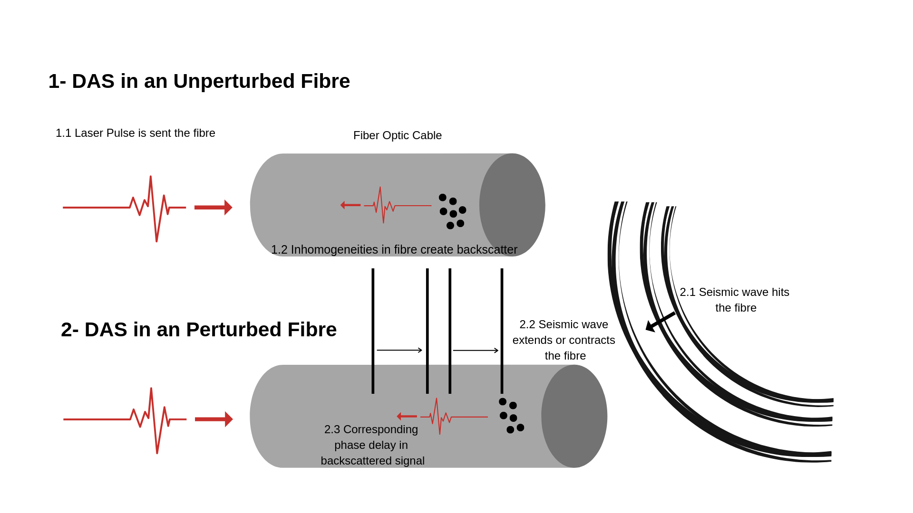

<!--more-->
# What is DAS And What Is It Measuring?

So, collecting Distributed Acoustic Sensing (DAS) data is the new and cool thing to do when it comes to seismic monitoring in oil and gas, mining and geothermal these days, but what actually is DAS measuring and how does this compare to traditional “point” measurements of ground motion made from geophones and seismometers? That is what we are going to address here, and along the way we’ll discuss some of the fundamentals of DAS measurements from a geophysical perspective. Then finally I’ll show how some common rules of DAS sensitivity (I call them DAS’isms) can be obtained from a very simple and much more general starting point. I do this for several reasons:

1. To explain why DAS data should be treated differently from standard seismic data.

2. To describe where the “rules” for DAS sensitivity (such as cosine-squared sensitivity) actually come from so that we know what they approximate and what the do not.

3. To correct some mis-conceptions that might still be out there.

4. To provide a basis I can refer back in order to start doing some really fun stuff.

Who is this all for? I hear you ask. Well if you are a geophysicist or seismologist who wants to understand a bit more about DAS data particularly from a theoretical standpoint then this page is for you. There is a little bit of math but I have tried to set things out in such a way that if math is not your thing then you can just gloss over it a read the text. Those who are already very knowledgeable on DAS systems I expect won’t find anything too surprising here. However, the line I am going to take is a little different compared to what most talks and papers take, so you might still gain some benefit from seeing familiar material described in a different way.

# What Does DAS Measure?

In my opinion the term DAS is somewhat misleading name for seismic measurement from a fibre optic cable. DAS stands for Distributed Acoustic Sensing, the “Distributed” bit is quite accurate (as we will see) and the “Sensing” bit I don’t have a problem with either, it is the “Acoustic” bit I have difficulty with. This is because, as a geophysicist, when I hear the term Acoustic I think of sound/ pressure waves in gas or fluid described by a scalar wave equation but this is not what DAS is measuring. When DAS is employed as a seismic sensor you are measuring strain in the fibre optic cable.  It has been pointed out to me that more general physicists used the term acoustic to describe the propagation of vibrations in solids so the term is not strictly wrong. plus everyone is already calling it DAS so this is the term we will use as well. However, it is important to remember as we go that DAS applied as a seismic setting is a strain sensor.

So how does the measurement work? This is a massive topic in itself which a lot of very clever people have worked very hard on. Needless to say there are all sort of specifics which vary with the different systems and deployment scenarios (downhole, surface trenched, behind casing …), but for our purposes here a simple drawing will suffice.

# How do DAS measurements relate to standard seismic data?

# Can you Convert DAS Data Into Point Sensor Data?

# Deriving DAS Responses

# Summary

# Acknowledgements References and Useful Links

